# JHMPro — UML Diagrams (PlantUML)

> Dibuat berdasarkan kondisi aktual kode per **2026-07-05**: `app/Models/*`, `database/migrations/*`, `routes/web.php`, `routes/settings.php`, `app/Livewire/**`, `app/Http/Middleware/CheckRole.php`, `app/Providers/FortifyServiceProvider.php`, `app/Observers/*`, `app/Console/Commands/*`.
>
> Semua elemen (atribut, tipe, enum, relasi, use case, alur) diambil langsung dari source code — bukan asumsi. Catatan ketidaksesuaian yang ditemukan di kode asli (mis. mismatch enum) ditandai eksplisit dengan komentar `note` di diagram terkait, **tidak diperbaiki** di sini karena di luar scope dokumen ini.
>
> Render: paste tiap blok ```plantuml``` ke [PlantUML online server](https://www.plantuml.com/plantuml) atau plugin PlantUML di IDE.

---

## 1. Use Case Diagram

Aktor didasarkan pada 2 guard auth (`web` untuk customer, `admin` untuk staff) dan kolom `users.role` (`super_admin`, `admin`, `mekanik`, `customer`), sesuai `CheckRole` middleware dan pengelompokan route di `routes/web.php`. "Scheduler" adalah aktor sistem yang memicu Artisan command terjadwal (bukan user manusia).

`SuperAdmin` adalah generalisasi dari `Admin` — setiap use case yang bisa diakses `Admin` otomatis bisa diakses `SuperAdmin`, ditambah use case eksklusif (RFM, Laporan, Pengaturan, Kelola Akun). Relasi ini digambar sekali di **1.1** dan tidak diulang di sub-diagram lain agar tetap ringkas.

Gaya visual mengikuti konvensi diagram use case klasik: oval polos garis hitam (tanpa warna isi), kotak sistem bertitel di tengah, aktor (stick-figure) di kiri/kanan yang terhubung dengan garis polos (tanpa panah) ke use case, dan relasi `<<include>>`/`<<extend>>` digambar sebagai panah putus-putus berlabel. Dipecah menjadi 6 sub-diagram per modul agar tetap mudah dibaca (bukan satu diagram raksasa).

### 1.1 Aktor & Autentikasi

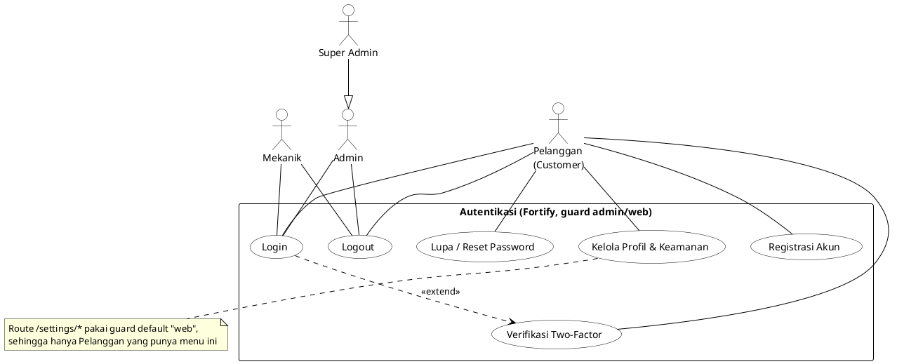

### 1.2 Pelanggan, Kendaraan & Partner

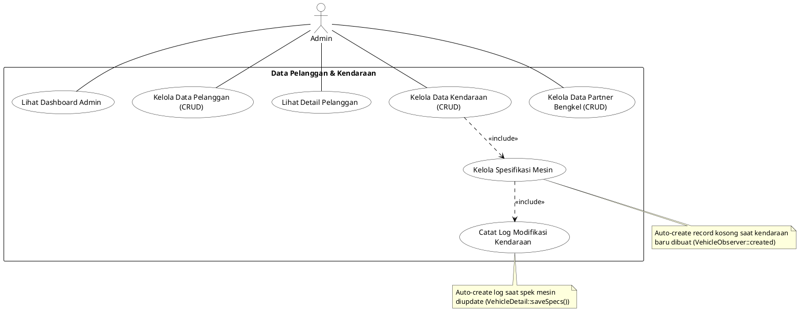

### 1.3 Layanan, Inventori & Produk

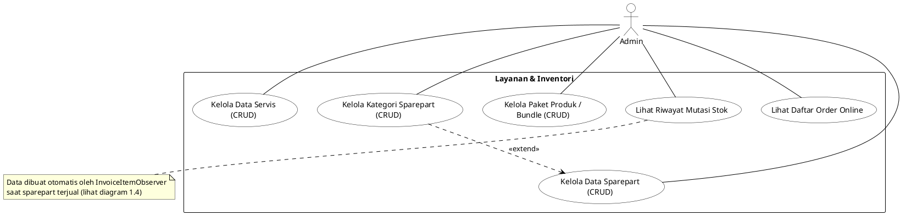

### 1.4 Transaksi Kasir (POS) & Work Order

```plantuml
@startuml UC_PosWorkOrder
skinparam backgroundColor white
skinparam shadowing false
skinparam ArrowColor black
skinparam usecase {
  BackgroundColor white
  BorderColor black
}
skinparam actor {
  BackgroundColor white
  BorderColor black
}
skinparam rectangle {
  BackgroundColor white
  BorderColor black
}

actor "Admin" as Admin
actor "Mekanik" as Mekanik

rectangle "POS & Work Order" {
  usecase "Transaksi Walk-in\n(Sparepart/Servis)" as UC_PosWalkIn
  usecase "Transaksi dari Work\nOrder Selesai" as UC_PosFromWO
  usecase "Buat Invoice" as UC_InvoiceCreate
  usecase "Lihat Daftar & Detail\nInvoice" as UC_InvoiceView
  usecase "Lihat Daftar & Detail\nWork Order" as UC_WOView
  usecase "Tetapkan Mekanik ke\nWork Order" as UC_WOAssign
  usecase "Update Status Work\nOrder (Admin)" as UC_WOUpdateAdmin
  usecase "Update Status Work\nOrder (Mekanik)" as UC_WOUpdateMekanik
  usecase "Tulis Catatan Pekerjaan" as UC_WONote
  usecase "Lihat Dashboard Mekanik" as UC_MekanikDashboard
}

Admin -- UC_PosWalkIn
Admin -- UC_PosFromWO
Admin -- UC_InvoiceView
Admin -- UC_WOView
Admin -- UC_WOAssign
Admin -- UC_WOUpdateAdmin

Mekanik -- UC_MekanikDashboard
Mekanik -- UC_WOUpdateMekanik
Mekanik -- UC_WONote

UC_PosWalkIn ..> UC_InvoiceCreate : <<include>>
UC_PosFromWO ..> UC_InvoiceCreate : <<include>>

note right of UC_WOUpdateMekanik
  Mekanik hanya bisa update status
  work order miliknya sendiri
  (abort_unless mekanik_id === auth id)
end note

@enduml
```

### 1.5 Booking Online

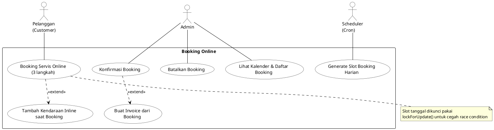

### 1.6 Analitik RFM, Laporan & Pengaturan

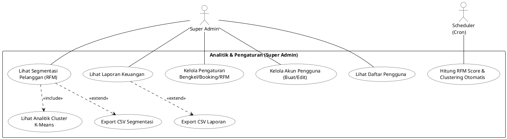

---

## 2. Activity Diagrams

Empat alur inti yang merepresentasikan bisnis proses utama JHMPro, diambil langsung dari logika di masing-masing Livewire component / Observer / Console Command.

### 2.1 Login (Role-based Redirect)

Sumber: `app/Providers/FortifyServiceProvider.php` (`authenticateUsing`), `App\Http\Responses\RoleBasedLoginResponse`.

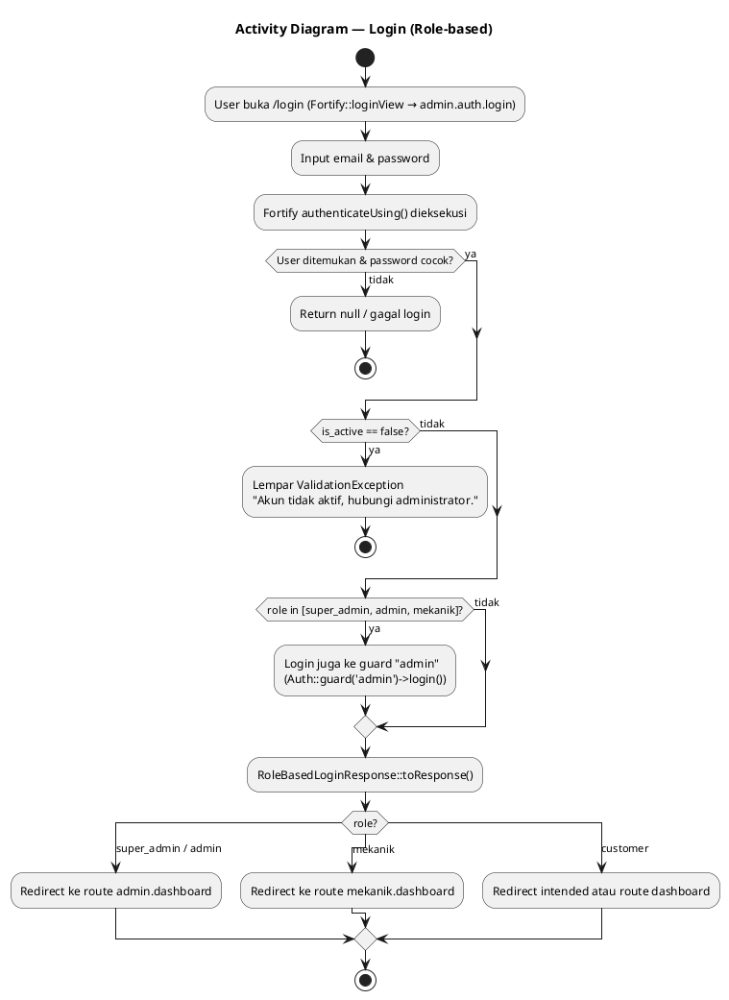

### 2.2 Booking Servis Online (Pelanggan)

Sumber: `app/Livewire/Website/Booking/BookingPage.php`.

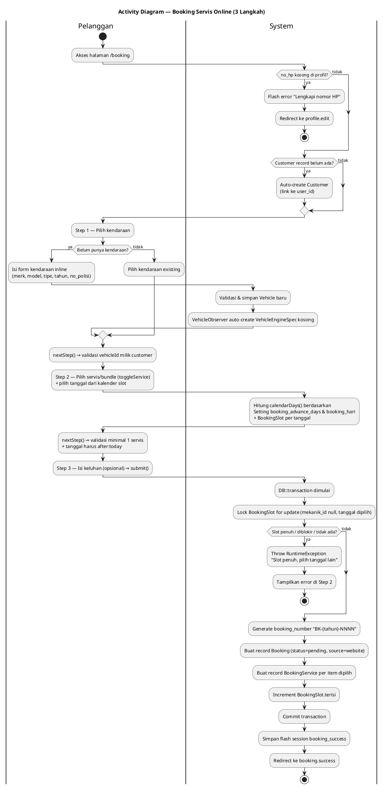

### 2.3 Transaksi Kasir (POS)

Sumber: `app/Livewire/Admin/Pos/PosPage.php`, `app/Observers/InvoiceItemObserver.php`.

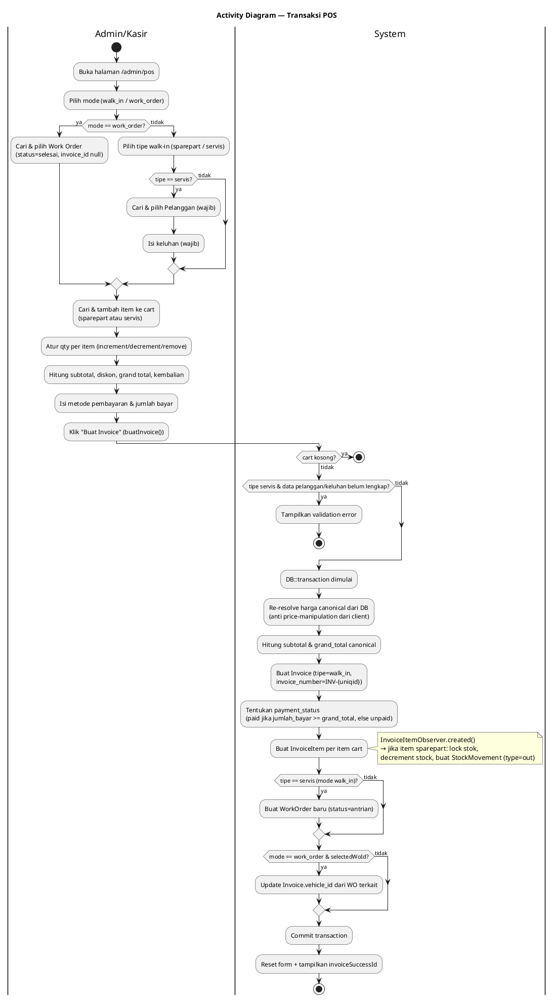

### 2.4 Siklus Work Order (Admin ↔ Mekanik)

Sumber: `app/Livewire/Admin/WorkOrders/WorkOrderDetail.php`, `app/Livewire/Mekanik/WorkOrders/MekanikWorkOrderDetail.php`.

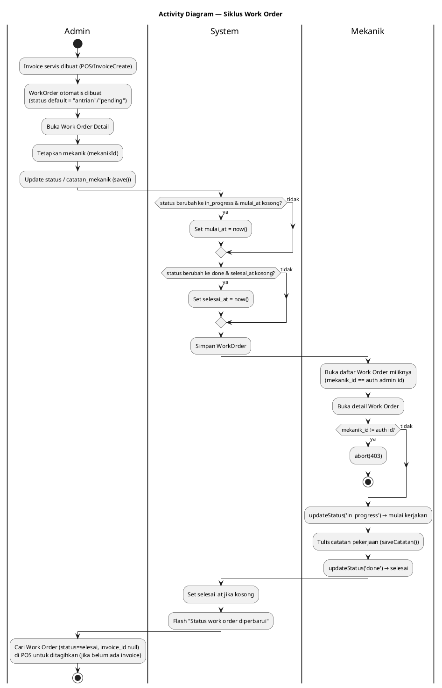

> **Catatan temuan:** kolom `work_orders.status` di migrasi (`database/migrations/2026_06_15_222816_create_core_tables.php`) adalah ENUM `antrian|proses|selesai` (default `antrian`), sedangkan kode Livewire (`WorkOrderDetail`, `MekanikWorkOrderDetail`, `WorkOrderIndex`) memvalidasi/menampilkan status `pending|in_progress|done|cancelled`. Diagram di atas menyertakan kedua istilah persis seperti di kode — ketidaksesuaian ini nyata di codebase saat ini dan tidak diperbaiki di dokumen ini (di luar scope dokumen UML).

### 2.5 Kalkulasi RFM & K-Means (Scheduler)

Sumber: `app/Console/Commands/CalculateRfm.php`.

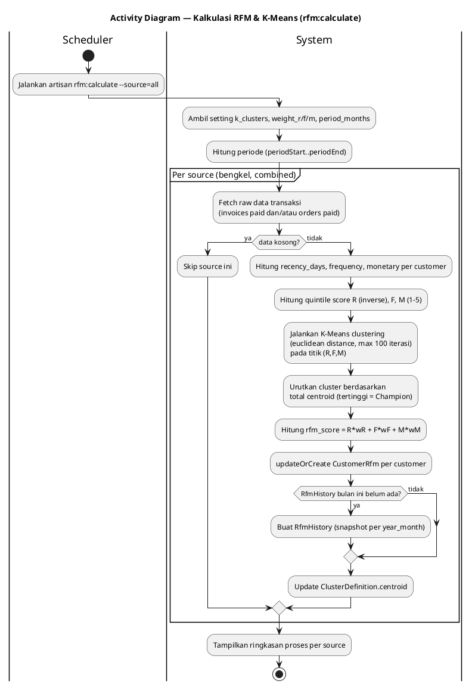

---

## 3. Class Diagram

Mencakup seluruh 25 Eloquent Model di `app/Models/` beserta atribut (dari `@property` PHPDoc + `$fillable`), method non-relasi, dan relasi Eloquent aktual (`belongsTo`, `hasMany`, `hasOne`, `morphMany`, `morphTo`).

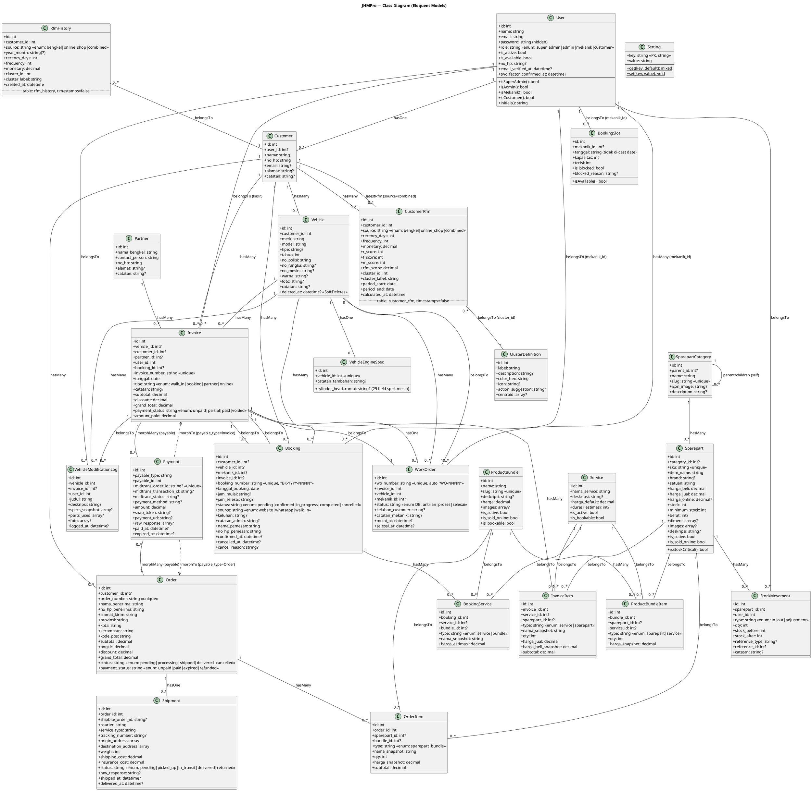

---

## 4. Entity Relationship Diagram (ERD)

Mengikuti persis struktur tabel di migration:
`0001_01_01_000000_create_users_table.php`, `2026_06_15_214251_create_settings_table.php`, `2026_06_15_222816_create_core_tables.php`, dan kolom tambahan dari 3 alter migration (`bookings.status` += `in_progress`, `bookings.source` enum di-set ulang, `work_orders.wo_number`, `customers.user_id`, `invoices.payment_status` += `voided`).

> **Catatan temuan:** tabel `motorcycles` dibuat oleh migrasi (`brand, model, type, tahun`) namun **tidak ada Eloquent Model** yang memakainya — tampaknya tabel legacy/tidak terpakai, digantikan oleh `vehicles`. Tabel infrastruktur framework (`sessions`, `cache`, `jobs`, `password_reset_tokens`, `notifications`) tidak digambar karena bukan bagian domain bisnis.

```plantuml
@startuml ERD
title JHMPro — Entity Relationship Diagram
skinparam linetype ortho
hide circle

entity "users" as users {
  * id : bigint <<PK>>
  --
  name : string
  * email : string <<unique>>
  email_verified_at : timestamp
  password : string
  * role : enum('super_admin','admin','mekanik','customer') = customer
  * is_active : boolean = true
  * is_available : boolean = true
  no_hp : string(20)
  remember_token : string
  timestamps
}

entity "customers" as customers {
  * id : bigint <<PK>>
  --
  # user_id : bigint <<FK, unique, nullable>>
  nama : string
  no_hp : string
  email : string
  alamat : text
  catatan : text
  timestamps
}

entity "partners" as partners {
  * id : bigint <<PK>>
  --
  nama_bengkel : string
  contact_person : string
  no_hp : string
  alamat : text
  catatan : text
  timestamps
}

entity "services" as services {
  * id : bigint <<PK>>
  --
  nama_service : string
  deskripsi : text
  harga_default : decimal(15,2)
  durasi_estimasi : int
  is_active : boolean = true
  is_bookable : boolean = false
  timestamps
}

entity "sparepart_categories" as sparepart_categories {
  * id : bigint <<PK>>
  --
  # parent_id : bigint <<FK self, nullable>>
  name : string
  * slug : string <<unique>>
  icon_image : string
  description : text
  timestamps
}

entity "spareparts" as spareparts {
  * id : bigint <<PK>>
  --
  # category_id : bigint <<FK, nullable>>
  * sku : string <<unique>>
  item_name : string
  brand : string
  satuan : string
  harga_beli : decimal(15,2)
  harga_jual : decimal(15,2)
  harga_online : decimal(15,2)
  stock : int = 0
  minimum_stock : int = 0
  berat : int
  dimensi : json
  images : json
  deskripsi : text
  is_active : boolean = true
  is_sold_online : boolean = false
  timestamps
}

entity "product_bundles" as product_bundles {
  * id : bigint <<PK>>
  --
  nama : string
  * slug : string <<unique>>
  deskripsi : text
  harga : decimal(15,2)
  images : json
  is_active : boolean = true
  is_sold_online : boolean = false
  is_bookable : boolean = false
  timestamps
}

entity "product_bundle_items" as product_bundle_items {
  * id : bigint <<PK>>
  --
  # bundle_id : bigint <<FK>>
  # sparepart_id : bigint <<FK, nullable>>
  # service_id : bigint <<FK, nullable>>
  * type : enum('sparepart','service')
  qty : int = 1
  harga_snapshot : decimal(15,2)
  timestamps
}

entity "cluster_definitions" as cluster_definitions {
  * id : bigint <<PK>>
  --
  label : string
  description : text
  color_hex : string
  icon : string
  action_suggestion : text
  centroid : json
  timestamps
}

note as N_motorcycles
  Tabel legacy — tidak ada Eloquent Model
  yang memakainya (digantikan "vehicles")
end note

entity "motorcycles" as motorcycles {
  * id : bigint <<PK>>
  --
  brand : string(100)
  model : string(100)
  type : string(100)
  tahun : year
  timestamps
}
N_motorcycles .. motorcycles

entity "vehicles" as vehicles {
  * id : bigint <<PK>>
  --
  # customer_id : bigint <<FK>>
  brand : string(100)
  merk : string
  model : string
  tipe : string
  tahun : year
  * no_polisi : string <<unique>>
  no_rangka : string
  no_mesin : string
  warna : string
  foto : string
  catatan : text
  timestamps
  deleted_at : timestamp <<SoftDeletes>>
}

entity "vehicle_engine_specs" as vehicle_engine_specs {
  * id : bigint <<PK>>
  --
  # vehicle_id : bigint <<FK, unique>>
  cylinder_head..rantai : string (29 kolom spek mesin)
  catatan_tambahan : text
  updated_at : timestamp
}

entity "vehicle_modification_logs" as vehicle_modification_logs {
  * id : bigint <<PK>>
  --
  # vehicle_id : bigint <<FK>>
  # invoice_id : bigint <<FK, nullable>>
  # user_id : bigint <<FK>>
  judul : string
  deskripsi : text
  specs_snapshot : json
  parts_used : json
  foto : json
  logged_at : timestamp
  timestamps
}

entity "invoices" as invoices {
  * id : bigint <<PK>>
  --
  # vehicle_id : bigint <<FK, nullable>>
  # customer_id : bigint <<FK, nullable>>
  # partner_id : bigint <<FK, nullable>>
  # user_id : bigint <<FK>>
  # booking_id : bigint <<FK, nullable>>
  * invoice_number : string <<unique>>
  tanggal : date
  * tipe : enum('walk_in','booking','partner','online')
  catatan : text
  subtotal : decimal(15,2)
  discount : decimal(15,2) = 0
  grand_total : decimal(15,2)
  * payment_status : enum('unpaid','partial','paid','voided') = unpaid
  amount_paid : decimal(15,2) = 0
  timestamps
}

entity "invoice_items" as invoice_items {
  * id : bigint <<PK>>
  --
  # invoice_id : bigint <<FK>>
  # service_id : bigint <<FK, nullable>>
  # sparepart_id : bigint <<FK, nullable>>
  * type : enum('service','sparepart')
  nama_snapshot : string
  qty : int = 1
  harga_jual : decimal(15,2)
  harga_beli_snapshot : decimal(15,2)
  subtotal : decimal(15,2)
  timestamps
}

entity "payments" as payments {
  * id : bigint <<PK>>
  --
  * payable_type : string <<morph>>
  * payable_id : bigint <<morph>>
  midtrans_order_id : string <<unique, nullable>>
  midtrans_transaction_id : string
  midtrans_status : string
  payment_method : string
  amount : decimal(15,2)
  snap_token : string
  payment_url : string
  raw_response : longtext
  paid_at : timestamp
  expired_at : timestamp
  timestamps
  .. index(payable_type, payable_id) ..
}

entity "work_orders" as work_orders {
  * id : bigint <<PK>>
  --
  * wo_number : string <<unique, "WO-NNNN">>
  # invoice_id : bigint <<FK>>
  # vehicle_id : bigint <<FK>>
  # mekanik_id : bigint <<FK, nullable>>
  * status : enum('antrian','proses','selesai') = antrian
  keluhan_customer : text
  catatan_mekanik : text
  mulai_at : timestamp
  selesai_at : timestamp
  timestamps
}

entity "bookings" as bookings {
  * id : bigint <<PK>>
  --
  # customer_id : bigint <<FK, nullable>>
  # vehicle_id : bigint <<FK, nullable>>
  # mekanik_id : bigint <<FK, nullable>>
  # invoice_id : bigint <<FK, nullable>>
  * booking_number : string <<unique, "BK-YYYY-NNNN">>
  tanggal_booking : date
  jam_mulai : time
  jam_selesai : time
  * status : enum('pending','confirmed','in_progress','completed','cancelled') = pending
  * source : enum('website','whatsapp','walk_in') = website
  keluhan : text
  catatan_admin : text
  nama_pemesan : string
  no_hp_pemesan : string
  confirmed_at : timestamp
  cancelled_at : timestamp
  cancel_reason : string
  timestamps
}

entity "booking_slots" as booking_slots {
  * id : bigint <<PK>>
  --
  # mekanik_id : bigint <<FK, nullable>>
  tanggal : date
  kapasitas : int
  terisi : int = 0
  is_blocked : boolean = false
  blocked_reason : string
  timestamps
}

entity "booking_services" as booking_services {
  * id : bigint <<PK>>
  --
  # booking_id : bigint <<FK>>
  # service_id : bigint <<FK, nullable>>
  # bundle_id : bigint <<FK, nullable>>
  * type : enum('service','bundle')
  nama_snapshot : string
  harga_estimasi : decimal(15,2)
  timestamps
}

entity "stock_movements" as stock_movements {
  * id : bigint <<PK>>
  --
  # sparepart_id : bigint <<FK>>
  # user_id : bigint <<FK>>
  * type : enum('in','out','adjustment')
  qty : int
  stock_before : int
  stock_after : int
  reference_type : string
  reference_id : bigint
  catatan : text
  timestamps
}

entity "orders" as orders {
  * id : bigint <<PK>>
  --
  # customer_id : bigint <<FK, nullable>>
  * order_number : string <<unique>>
  nama_penerima : string
  no_hp_penerima : string
  alamat_kirim : text
  provinsi : string
  kota : string
  kecamatan : string
  kode_pos : string
  subtotal : decimal(15,2)
  ongkir : decimal(15,2) = 0
  discount : decimal(15,2) = 0
  grand_total : decimal(15,2)
  * status : enum('pending','processing','shipped','delivered','cancelled') = pending
  * payment_status : enum('unpaid','paid','expired','refunded') = unpaid
  timestamps
}

entity "order_items" as order_items {
  * id : bigint <<PK>>
  --
  # order_id : bigint <<FK>>
  # sparepart_id : bigint <<FK, nullable>>
  # bundle_id : bigint <<FK, nullable>>
  * type : enum('sparepart','bundle')
  nama_snapshot : string
  qty : int
  harga_snapshot : decimal(15,2)
  subtotal : decimal(15,2)
  timestamps
}

entity "shipments" as shipments {
  * id : bigint <<PK>>
  --
  # order_id : bigint <<FK>>
  shipbite_order_id : string
  courier : string
  service_type : string
  tracking_number : string
  origin_address : json
  destination_address : json
  weight : int
  shipping_cost : decimal(15,2)
  insurance_cost : decimal(15,2) = 0
  * status : enum('pending','picked_up','in_transit','delivered','returned') = pending
  raw_response : longtext
  shipped_at : timestamp
  delivered_at : timestamp
  timestamps
}

entity "customer_rfm" as customer_rfm {
  * id : bigint <<PK>>
  --
  # customer_id : bigint <<FK>>
  * source : enum('bengkel','online_shop','combined')
  recency_days : uint
  frequency : uint
  monetary : decimal(15,2)
  r_score : utinyint
  f_score : utinyint
  m_score : utinyint
  rfm_score : decimal(5,2)
  # cluster_id : int <<ref ClusterDefinition, bukan FK constraint>>
  cluster_label : string
  period_start : date
  period_end : date
  calculated_at : timestamp
  .. no timestamps() ..
}

entity "rfm_history" as rfm_history {
  * id : bigint <<PK>>
  --
  # customer_id : bigint <<FK>>
  * source : enum('bengkel','online_shop','combined')
  year_month : string(7)
  recency_days : uint
  frequency : uint
  monetary : decimal(15,2)
  cluster_id : int
  cluster_label : string
  created_at : timestamp
  .. no timestamps() ..
}

entity "settings" as settings {
  * key : string <<PK>>
  --
  value : text
  timestamps
}

' ── Relasi ──
users ||--o{ work_orders : "mekanik_id"
users ||--o{ bookings : "mekanik_id"
users ||--o{ booking_slots : "mekanik_id"
users ||--o{ invoices : "user_id (kasir)"
users ||--o{ stock_movements : "user_id"
users ||--o{ vehicle_modification_logs : "user_id"
users |o--o| customers : "user_id (nullable, unique)"

customers ||--o{ vehicles : "customer_id"
customers ||--o{ invoices : "customer_id"
customers ||--o{ bookings : "customer_id"
customers ||--o{ orders : "customer_id"
customers ||--o{ customer_rfm : "customer_id"
customers ||--o{ rfm_history : "customer_id"

partners ||--o{ invoices : "partner_id"

sparepart_categories ||--o{ sparepart_categories : "parent_id"
sparepart_categories ||--o{ spareparts : "category_id"

spareparts ||--o{ stock_movements : "sparepart_id"
spareparts ||--o{ invoice_items : "sparepart_id"
spareparts ||--o{ product_bundle_items : "sparepart_id"
spareparts ||--o{ order_items : "sparepart_id"

product_bundles ||--o{ product_bundle_items : "bundle_id"
product_bundles ||--o{ booking_services : "bundle_id"
product_bundles ||--o{ order_items : "bundle_id"

services ||--o{ invoice_items : "service_id"
services ||--o{ product_bundle_items : "service_id"
services ||--o{ booking_services : "service_id"

vehicles ||--o| vehicle_engine_specs : "vehicle_id"
vehicles ||--o{ vehicle_modification_logs : "vehicle_id"
vehicles ||--o{ invoices : "vehicle_id"
vehicles ||--o{ work_orders : "vehicle_id"
vehicles ||--o{ bookings : "vehicle_id"

invoices ||--o{ invoice_items : "invoice_id"
invoices |o--o| work_orders : "invoice_id"
invoices ||--o{ vehicle_modification_logs : "invoice_id"
invoices |o--o| bookings : "invoice_id"
invoices ||--o{ payments : "payable (morph)"

bookings ||--o{ booking_services : "booking_id"

orders ||--o{ order_items : "order_id"
orders |o--o| shipments : "order_id"
orders ||--o{ payments : "payable (morph)"

cluster_definitions ||--o{ customer_rfm : "cluster_id (referensi, bukan FK constraint)"

@enduml
```

---

## 5. Ringkasan Sumber

| Diagram | Sumber utama |
|---|---|
| Use Case | `routes/web.php`, `routes/settings.php`, `app/Http/Middleware/CheckRole.php` |
| Activity — Login | `app/Providers/FortifyServiceProvider.php`, `app/Http/Responses/RoleBasedLoginResponse.php` |
| Activity — Booking | `app/Livewire/Website/Booking/BookingPage.php` |
| Activity — POS | `app/Livewire/Admin/Pos/PosPage.php`, `app/Observers/InvoiceItemObserver.php` |
| Activity — Work Order | `app/Livewire/Admin/WorkOrders/WorkOrderDetail.php`, `app/Livewire/Mekanik/WorkOrders/MekanikWorkOrderDetail.php` |
| Activity — RFM | `app/Console/Commands/CalculateRfm.php` |
| Class Diagram | `app/Models/*.php` (25 model) |
| ERD | `database/migrations/*.php` (semua migration, termasuk 5 alter migration) |
